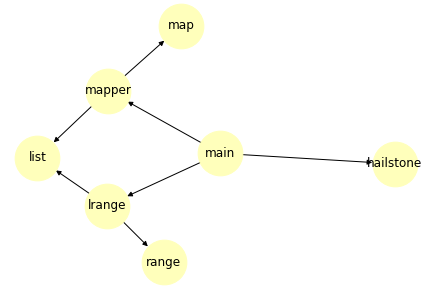

# ast_scope

This package is an implementation of Python's lexical scoping rules. It's interface is simple, you pass in an AST object to the `annotate` function, and it provides a mapping from each node in the tree that represents a symbol to the containing scope.

## Example Usage: Get Global Symbols

Let's say you have the code

```
code = """
def f():
    x = 3
    lambda z: theta
    return x + y
"""
```

and you want to determine which global variables are referenced by it. All you need to do is run

```
import ast
import ast_scope
tree = ast.parse(code)
scope_info = ast_scope.annotate(tree)
global_variables = sorted(scope_info.global_scope.symbols_in_frame)
```

Once you have executed this code, `global_variables` will be bound to `['f', 'theta', 'y']`.

## Example Usage: Get Dependency Graph

Let's say you have the code

```
code = """
def hailstone(n):
    if n == 1:
        return 1
    if n % 2 == 0:
        return hailstone(n // 2)
    if n % 2 == 1:
        return hailstone(3 * n + 1)

def mapper(f, lst):
    return list(map(f, lst))

def lrange(n):
    return list(range(n))

def main():
    return mapper(hailstone, lrange(20))
"""
```

and you want to find the dependency graph. You can run

```
import ast
import ast_scope
tree = ast.parse(code)
scope_info = ast_scope.annotate(tree)
graph = scope_info.static_dependency_graph
```

which results in the following directed graph of dependencies between top-level functions (rendering using networkx):



See the documentation for some caveats.

## Example usage: find a specific symbol's scope

Take the following code:

```
code = """
def f(x):
    def g(x): return x()
    return g(lambda: x)
"""
```

First, parse the code and identify the node (in practice, you'd probably have this always).

```
import ast, ast_scope
tree = ast.parse(code)
last_x = tree.body[0].body[-1].value.args[0].body
```

If you want to find the scope in which the last `x` could be found, just run the annotator and look up it's scope!

```
# run the annotator
scope_info = ast_scope.annotate(tree)
scope_x = scope_info[last_x]
```

You should get a `FunctionScope` object which contains a bunch of information about the other variables, etc., in the scope, but also `scope_x.function_node`, a pointer to the node containing the `def` statement for `f`.
